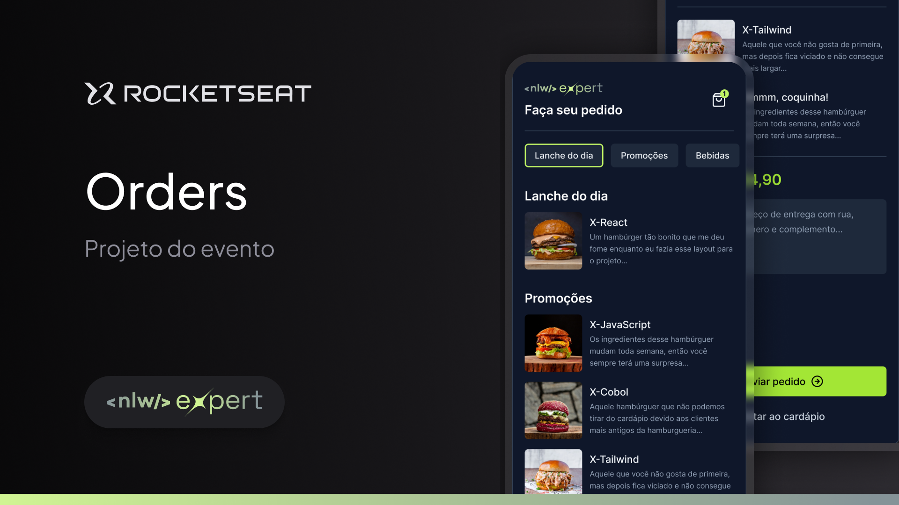

<h1 align="center"> Orders Expert </h1>

<p align="center">
Essa aplicação foi desenvolvida durante o NLW Expert da Rocketseat, na trilha de React Native. <br/>
</p>

<p align="center">
  
</p>

<p align="center">
  
</p>

### 🚀 Tecnologias

Esse projeto foi desenvolvido com as seguintes tecnologias:

- React Native
- Expo
- TailwindCss
- NativeWind
- Figma

### 💻 Executando

Após clonar o repositório, acesse a pasta do projeto e execute os comandos abaixo:

```sh
npm install
npx expo start
```

### :memo: Licença

Esse projeto está sob a licença MIT.

---

Feito com ♥ by Isadora Aguiar
